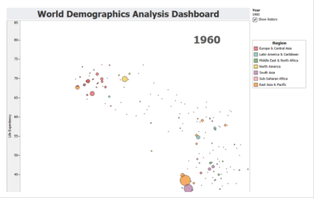
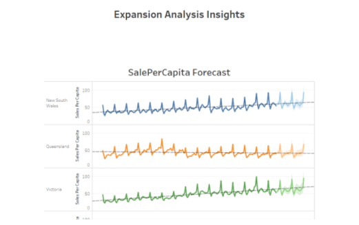
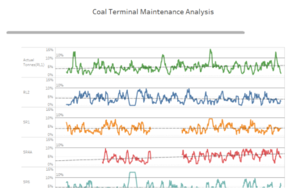

## Projects

- **[Marketing Predictive Analytics to Increase Revenue for Hertz Car Rental](https://public.tableau.com/profile/aji.somaraj#!/vizhome/CustomerStudy_0/Dashboard1)** - Worked collaboratively on a team of 4 in the Hertz’s car rental dataset using SAS to provide optimal pricing and marketing strategies for customer segments based on elasticity modeling, MARCOM evaluations, and linear regression, increasing the revenue by $43.1 million.  Check out a [demo online](https://public.tableau.com/profile/aji.somaraj#!/vizhome/CustomerStudy_0/Dashboard1). Available [on GitHub](https://public.tableau.com/profile/aji.somaraj#!/vizhome/CustomerStudy_0/Dashboard1).

- **[Applied Machine Learning Using R](https://public.tableau.com/profile/aji.somaraj#!/vizhome/CustomerStudy_0/Dashboard1)** - Evaluated the performance of various supervised and unsupervised learning algorithms on the Adult Income and Bank Marketing Datasets using learning curves and different performance metrics using R packages like caret, H2o, ggplot2, XGBoost.  Check out a [demo online](https://public.tableau.com/profile/aji.somaraj#!/vizhome/CustomerStudy_0/Dashboard1). Available [on GitHub](https://public.tableau.com/profile/aji.somaraj#!/vizhome/CustomerStudy_0/Dashboard1).

- **[Applied Econometrics to Identify Impact of U.S. Drunk Driving Laws on Traffic Fatalities](https://public.tableau.com/profile/aji.somaraj#!/vizhome/CustomerStudy_0/Dashboard1)** - Analyzed U.S. panel data from 7 years to model alcohol-related fatalities for different age-groups; built fixed effects model (entity and time); tested for heteroskedasticity and endogeneity, Identified mandatory jail and minimum legal drinking age as the best drunk driving policies.  Check out a [demo online](https://public.tableau.com/profile/aji.somaraj#!/vizhome/CustomerStudy_0/Dashboard1). Available [on GitHub](https://public.tableau.com/profile/aji.somaraj#!/vizhome/CustomerStudy_0/Dashboard1).

- **[Predict Income from Census Income Dataset](https://public.tableau.com/profile/aji.somaraj#!/vizhome/CustomerStudy_0/Dashboard1)** - Developed a prediction model using R and big data tools to predict income levels based on census data; Pre-processed data using Hive; Used ggplot2 package in R for data exploration and visualization; Predictive Classifier models were modeled in R leading to the best models with sensitivity - SVM (85%), Neural Net (79%), Bagging (80.72%).  Check out a [demo online](https://public.tableau.com/profile/aji.somaraj#!/vizhome/CustomerStudy_0/Dashboard1). Available [on GitHub](https://public.tableau.com/profile/aji.somaraj#!/vizhome/CustomerStudy_0/Dashboard1).

- **[Allstate Purchase Prediction Model](https://public.tableau.com/profile/aji.somaraj#!/vizhome/CustomerStudy_0/Dashboard1)** - Developed a predictive model to determine whether a customer will opt for a particular insurance policy or not, so as to shorten the quoting process; Preformed data exploration, preprocessing and visualization using Tableau and R; Analyzed the factors that influence the customers purchase pattern and utilized several machine learning algorithms such as logistic regression, decision tree, and random forests to predict the purchase pattern.  Check out a [demo online](https://public.tableau.com/profile/aji.somaraj#!/vizhome/CustomerStudy_0/Dashboard1). Available [on GitHub](https://public.tableau.com/profile/aji.somaraj#!/vizhome/CustomerStudy_0/Dashboard1).

- **[Agricultural Resource Optimization Model](https://public.tableau.com/profile/aji.somaraj#!/vizhome/CustomerStudy_0/Dashboard1)** - Developed a resource allocation optimization model which allocates the significant resources land and water by the selected crop using a multi-objective genetic algorithm (MOGA); Data collected from Kerala Agricultural University was explored, preprocessed and modeled using Stat-fit, Minitab, MySQL, and Java.  Check out a [demo online](https://public.tableau.com/profile/aji.somaraj#!/vizhome/CustomerStudy_0/Dashboard1). Available [on GitHub](https://public.tableau.com/profile/aji.somaraj#!/vizhome/CustomerStudy_0/Dashboard1).

---

|    |    |   |
|pro name|pro name|pro name|
|    |    |   |
|pro name|pro name|pro name|
|    |    |   |
|pro name|pro name|pro name|

This is a collection of some personal projects I've worked on that are easily viewable online. Anything that is not browser-friendly will not make the cut :(

I'm also [**available for consulting**](), so feel free to [contact me]() if it looks like we could work together. 
---
